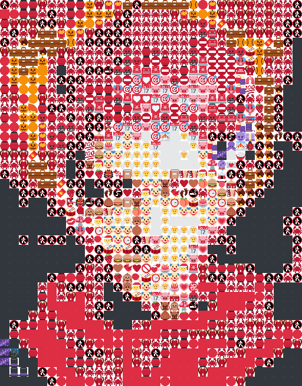

# emojify
### Turn your images into elegant emoji grids
---

## Examples

(If these images have credits please let me know)

| Input | Output |
| :-------: | :-------: |
|  |  |
|  |  |

## Usage

You know how to build Rust apps. Two binaries are built: `emojify`, and `emojify-camera`

The simplest usage is to have an image and a width in mind.

`./emojify <output grid width> path/to/image.png`

`./emojify <output grid width> path/to/image.gif`

This will make an image `output.png` or `output.gif` in the same folder as the `emojify` program.

You can also use an image in your clipboard, or have it download an image/GIF from a URL in your clipboard by omitting a file path.

`./emojify <output grid width>`

This program utilizes multiprocessing for each pixel conversion, and is really fast as a result. So fast, in fact, that this repo also builds, `emojify-camera`, which works in real time at certain resolutions.

`./emojify-camera <output grid width>`

## Custom Emoji/Image sets

`emojify` can use any emoji font (and also technically any image set at all, but you're on your own there).

The two files of concern are `src/emojimap.rs` and `src/config.rs`. To add a new emoji font, it should be a folder of images, all the same size, named after the lowercase codepoint of an emoji glyph in Unicode. See how it looks on my end:

```
$ tree ~/emojifont/ | head
~/emojifont/
├── 1f004.png
├── 1f0cf.png
├── 1f170.png
├── 1f171.png
├── 1f17e.png
├── 1f17f.png
├── 1f18e.png
├── 1f191.png
└── 1f192.png
```

Next, edit `src/config.rs` so `EMOJI_WD` and `EMOJI_HT` match your new font. Additionally, point the format path in `get_emoji_path` to your own font folder (discard the provided `home` argument as necessary).

Finally, regenerate the hashmap stored in `src/emojimap.rs`, as that color data is generated from 16x16 sample data from [Twemoji](https://github.com/twitter/twemoji).

## Limitations

- Compound emojis joined with a ZWJ do not work.

## Acknowledgments

- [Twemoji](https://github.com/twitter/twemoji)
  - I generated `src/rgb2emoji.rs` based on the images provided in the repo, but `emojify` does not otherwise depend on Twemoji. You can put in your own emoji fonts if you want.
